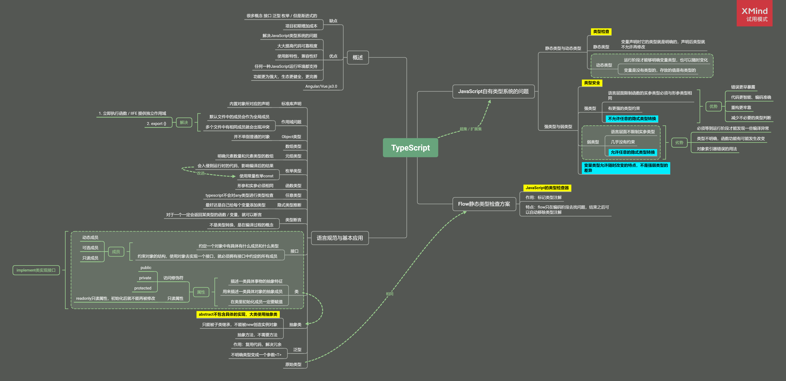

# 学

一、[函数式编程](https://github.com/janeLLLL/blog/issues/1)

二、JavaScript

1. [JavaScript异步编程](https://github.com/janeLLLL/blog/issues/2)

   

2. [手写Promise](https://github.com/janeLLLL/blog/issues/3)

3. [ECMAScript新特性](https://github.com/janeLLLL/blog/issues/4)

4. [TypeScript语言](https://github.com/janeLLLL/blog/issues/5)（介绍、基础）

   

   - [配置使用typescript : 全新项目 / 已有项目](https://github.com/janeLLLL/blog/issues/13)

5. [JavaScript性能优化](https://github.com/janeLLLL/blog/issues/6)

   

6. 问题：[JavaScript的一些小问题-GC触发机制 / heap size的优化 / 组件化开发模式的优化](https://github.com/janeLLLL/blog/issues/12)

三、工程化

1. [开发脚手架及封装自动化构建工作流](https://github.com/janeLLLL/blog/issues/10)（介绍、原理）
2. 实例
   - [如何自定义一个小型脚手架工具](https://github.com/janeLLLL/blog/issues/7)
   - [使用 Grunt 完成项目的自动化构建](https://github.com/janeLLLL/blog/issues/8)
   - 使用Gulp完成项目的自动化构建
   - 以上三点详见./code

待续。。。