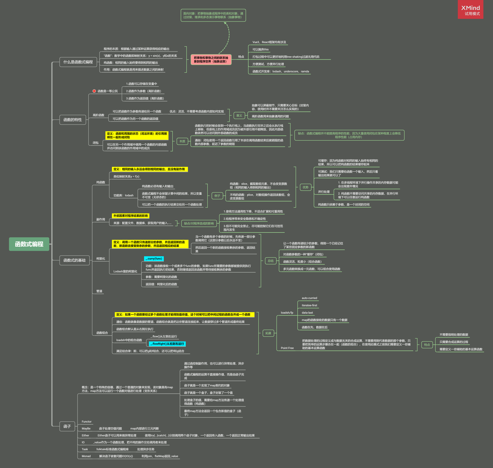
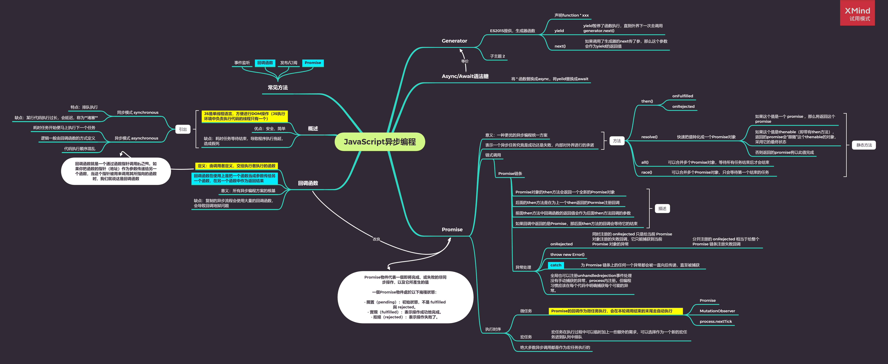
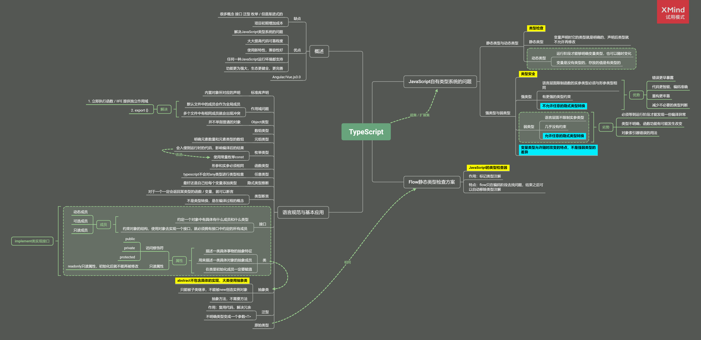
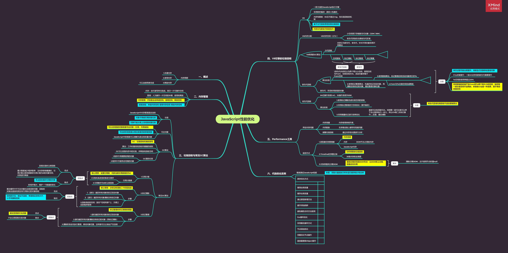
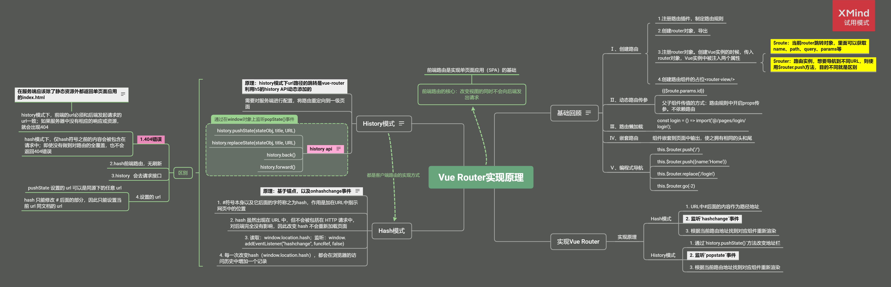
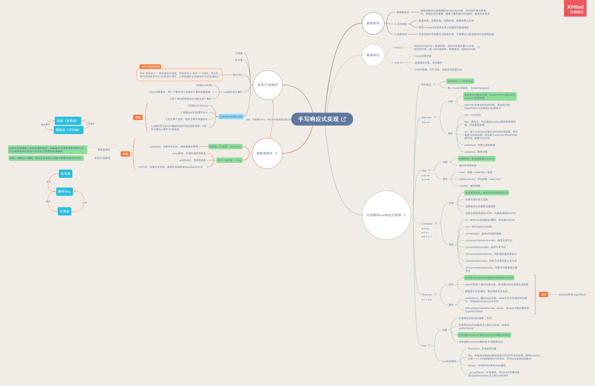
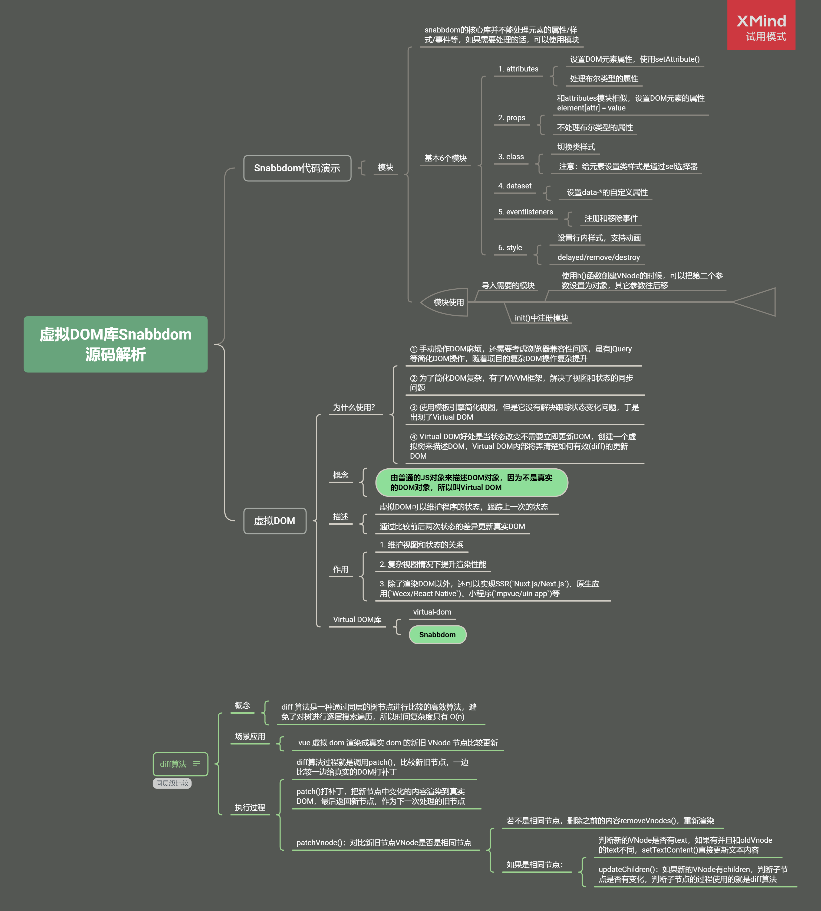

web开发人员 | 学习者 | 影迷 

- 很老土，但是我仍旧需要一些“鸡汤”假装自己还可以被激励

# 目录

- [**面试记录**](#面试记录)
- [**学习记录**](#学习记录)
- [**工作难题**](#工作难题)
- [**储备知识**](#储备知识)

# 面试记录

[空手套题（一）-4399/六一/交易猫/网易/博智林/浩鲸云](https://github.com/janeLLLL/blog/issues/14)

[空手套题（二）-小满/米哈游](https://github.com/janeLLLL/blog/issues/20)

> 米哈游面试官：你是工作一年吗？你是社招吧？你的基础为什么这么差？
>
> 所以我开始了👇

# 学习记录

一、[函数式编程](https://github.com/janeLLLL/blog/issues/1)

二、JavaScript

1. [JavaScript异步编程](https://github.com/janeLLLL/blog/issues/2)

   

2. [手写Promise](https://github.com/janeLLLL/blog/issues/3)

3. [ECMAScript新特性](https://github.com/janeLLLL/blog/issues/4)

4. [TypeScript语言](https://github.com/janeLLLL/blog/issues/5)（介绍、基础）

   

   - [配置使用typescript : 全新项目 / 已有项目](https://github.com/janeLLLL/blog/issues/13)

5. [JavaScript性能优化](https://github.com/janeLLLL/blog/issues/6)

   

6. 问题：[JavaScript的一些小问题-GC触发机制 / heap size的优化 / 组件化开发模式的优化](https://github.com/janeLLLL/blog/issues/12)

三、工程化

1. [开发脚手架及封装自动化构建工作流](https://github.com/janeLLLL/blog/issues/10)（介绍、原理）
2. 实例
   - [如何自定义一个小型脚手架工具](https://github.com/janeLLLL/blog/issues/7)
   - [使用 Grunt 完成项目的自动化构建](https://github.com/janeLLLL/blog/issues/8)
   - 使用Gulp完成项目的自动化构建
   - 以上三点详见./code

四、Vue.js框架源码与进阶（但我仍需要补基础）

1. [Vue-Router实现原理](https://github.com/janeLLLL/blog/issues/25)

   

2. [Vue.js手写响应式实现](https://github.com/janeLLLL/blog/issues/26)

   

3. [虚拟DOM库Snabbdom](https://github.com/janeLLLL/blog/issues/27)

   - [网上传的最广的diff算法简述](https://github.com/janeLLLL/blog/issues/24)

   （我还会总结一份diff算法流程图）

   